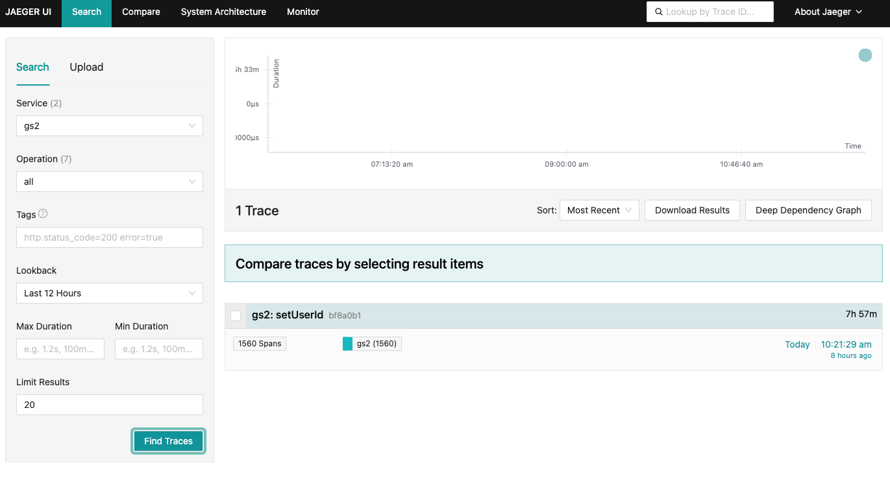
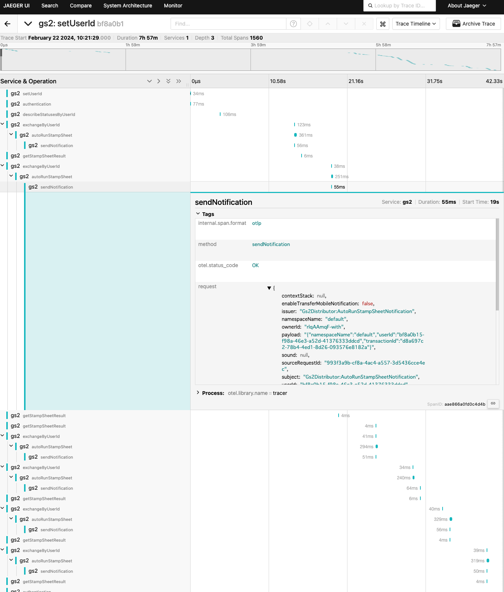

# GS2-Telemetry

GS2-Telemetry is a tool for visualizing GS2 access logs in terms of performance tuning.

GS2-Telemetry has a function to process log information collected by GS2-Log and send it to an external server in Open Telemetry format.

This feature allows you to visualize requests using the Open Telemetry visualization tool, which can be useful for performance tuning, such as whether you are generating more requests than necessary or whether there is room for parallelization to speed up processing.

## How to use

### Run open telemetry server(Jaeger)

```
docker run -d --name jaeger \
  -p 4317:4317 \
  -p 4318:4318 \
  -p 16686:16686 \
  jaegertracing/all-in-one:latest
```

### Collect telemetry from GS2-Log

```
gs2-telemetry -clientid "your gs2 client id" -secret "your gs2 client secret" -namespace "your gs2 log namespace name" -begin "2024-01-01T00:00:00+09:00" -end "2024-02-01T00:00:00+09:00"
```

#### Parameters

| Name      | Description                                    |
|-----------|------------------------------------------------|
| clientid  | GS2 Client ID                                  |
| secret    | GS2 Client Secret                              |
| region    | GS2 Region(default: ap-northeast-1)            |
| namespace | GS2 Log Namespace Name                         |
| host      | Open Telemetry Server Host(default: localhost) |
| port      | Open Telemetry Server Port(default: 4317)      |
| begin     | Begin Time(RFC3339 format)                     |
| end       | End Time(RFC3339 format)                       |

### Open Jaeger UI

Open `http://localhost:16686` in your browser.

Request Tracing by User Id


View Timeline of Request


## License

MIT License
